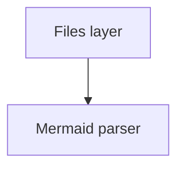

# CONTRACTS — the interfaces every task builds against

This file is authoritative. If your task needs to deviate, implement your side to this contract anyway and report the deviation in your final message. Do not silently rename anything here.

Read also: `docs/research/claude-code.md`, `docs/research/tldraw-mermaid.md`, `docs/research/python-server.md`, and the PRD context in the plan.

## 0. Vocabulary and ids

- **project root**: the user's project directory (`--project-dir`). Its whiteboard state lives in `<root>/.whiteboard/`.
- **node**: one unit of the plan/task graph. `id` matches `^node-[a-z0-9][a-z0-9-]*$`. File `.whiteboard/plan/nodes/<id>.md`.
- **agent**: one subagent. `id` matches `^agent-[a-z0-9][a-z0-9-]*$`. Folder `.whiteboard/agents/<id>/`.
- **diagram**: a markdown file in `.whiteboard/plan/` containing one ```mermaid flowchart. Diagram name = file stem (`hld`, `er`). Box ids in a diagram are node ids.
- **edge**: `A --> B` in a diagram means **B depends on A** (`B.depends_on` contains `A`). Frontmatter `depends_on` is authoritative when the two disagree; the server rewrites the diagram to match.
- **seq**: monotonic integer assigned by `EventLog` on append; also used as the `seq` of every websocket broadcast that carries an event. Websocket messages that are not events carry their own per-connection counter (see §6).
- Timestamps: ISO-8601 UTC with `Z`, e.g. `2026-09-20T00:14:22.123Z`.

## 1. Files on disk (`.whiteboard/`)

```
.whiteboard/
├── PLAN.md                  # regenerated by server: overview table + full flowchart; never hand-edit
├── COLLABORATION.md         # from template; human-editable; agents must read before acting
├── plan/
│   ├── hld.md               # markdown with ONE ```mermaid flowchart block
│   ├── er.md
│   ├── hld.layout.json      # sidecar, gitignored
│   └── nodes/<node-id>.md
├── agents/<agent-id>/
│   ├── card.md
│   ├── plan.md              # job spec (markdown)
│   └── diagrams.md
├── events.jsonl
├── server.json              # runtime, gitignored
├── server.log               # runtime, gitignored
└── .cache/last_good.json    # runtime, gitignored
```

### Node file
```markdown
---
id: node-parser
type: lld            # hld | lld | er
title: Mermaid parser
status: todo         # todo | in_progress | blocked | done
owner: null          # null | agent-<slug>
depends_on:
  - node-files
interfaces:
  - "parse(text) -> MermaidDoc"
  - "serialize(doc) -> str"
---

Free markdown body. May contain its own ```mermaid block (LLD). Body is preserved byte-exact by the server.
```
Frontmatter key order is fixed as above; unknown keys are preserved after `interfaces`. `interfaces` entries are strings (free text) or `{name, kind}` objects; both accepted, strings preferred.

### Diagram file (`plan/hld.md`)
```markdown
# HLD


```
Only the first mermaid block is the graph. Box labels are node titles. Nodes that exist in `nodes/` but not in the diagram are appended by the server on regeneration; boxes in the diagram with no node file are created as `type: hld, status: todo` node files by the server (diagram-first editing is allowed).

### Agent card (`agents/<id>/card.md`)
```markdown
---
id: agent-parser
assigned_node: node-parser
status: idle          # idle | working | blocked | done
claude_agent_ref: null   # name/id the root uses with SendMessage; set by root after spawning
ready_deps: []        # node ids among assigned_node.depends_on that are done
spawned_at: null
---

Optional notes.
```

### Event log (`events.jsonl`), one JSON object per line
```json
{"seq": 12, "ts": "2026-09-20T00:14:22.123Z", "agent_id": "agent-parser", "node_id": "node-parser", "type": "done", "note": "parser + serializer landed, 41 tests", "notified": ["agent-store"], "data": {}}
```
`type` ∈ `done | blocked | needs_input | reply | chat | dispatch_proposed | dispatch_approved | dispatch_rejected | spawned | risky_edit | risky_edit_accepted | risky_edit_rejected | plan_pasted | node_changed | agent_changed | info`.
`agent_id` may be `"root"` or `"user"` or `"server"`. `node_id` may be null. `data` is free JSON (e.g. `{"prompt_id": "...", "choices": [...]}` for needs_input; `{"to": "agent-x"}` for chat; `{"ops": [...]}` for risky_edit).

### Layout sidecar (`plan/<diagram>.layout.json`)
```json
{"version": 1, "direction": "TD", "updatedAt": "...",
 "frames": {"plan-board": {"x": 0, "y": 0, "w": 1200, "h": 800, "collapsed": false}},
 "nodes": {"node-parser": {"x": 120, "y": 340, "w": 200, "h": 80, "parent": "plan-board", "pinned": true}},
 "agents": {"agent-parser": {"x": 1300, "y": 40, "w": 240, "h": 110}},
 "edges": {"node-files__node-parser": {"startAnchor": [0.5, 1], "endAnchor": [0.5, 0], "precise": false}}}
```
Page coordinates. Written only by the server on `canvas.layout`, never touches markdown.

### `server.json`
```json
{"pid": 4242, "port": 43217, "started_at": "...", "project": "/abs/path", "url": "http://127.0.0.1:43217", "mcp_url": "http://127.0.0.1:43217/mcp", "version": 1}
```

### `~/.whiteboard/registry.json`
```json
{"/abs/project/path": {"port": 43217, "pid": 4242, "started_at": "..."}}
```

## 2. `whiteboard.files` (T1)

```python
# whiteboard/files/atomic.py
def atomic_write(path: Path, data: bytes, *, fsync: bool = True) -> None
def read_bytes(path: Path) -> bytes | None          # None if missing

class SelfWriteRegistry:
    """path -> sha256 of bytes we wrote; used to swallow our own watcher echo once."""
    def note(self, path: Path, data: bytes) -> None
    def is_echo(self, path: Path, data: bytes) -> bool   # True (and forgets) if digest matches; otherwise forgets and returns False

# whiteboard/files/frontmatter.py
def split_frontmatter(text: str) -> tuple[dict, str]     # ({}, text) when absent/invalid; body byte-exact
def join_frontmatter(meta: dict, body: str) -> str       # "---\n<yaml sort_keys=False>---\n\n<body without leading newlines>"
def order_keys(meta: dict, first: list[str]) -> dict      # returns new dict with `first` keys in order then the rest in original order

# whiteboard/files/jsonl.py
def append_jsonl(path: Path, record: dict) -> None        # O_APPEND + flock + one os.write; creates file
class JsonlTailer:
    def __init__(self, path: Path) -> None
    def read_new(self) -> list[dict]                       # new complete records since last call; handles truncation/rotation and torn lines
    def read_all(self) -> list[dict]                       # from byte 0 (resets offset to end)

# whiteboard/files/watcher.py
class MarkdownBridge(PatternMatchingEventHandler):
    """patterns ['*.md', '*.jsonl']; ignores paths containing '/.cache/', '.layout.json', 'server.log', temp files starting with '.'.
    on_any_event -> loop.call_soon_threadsafe(queue.put_nowait, dest_or_src_path)"""
    def __init__(self, loop: asyncio.AbstractEventLoop, queue: asyncio.Queue[str]) -> None
def start_observer(loop, queue, root: Path) -> Observer    # recursive on root/.whiteboard; started
async def debounce_worker(queue: asyncio.Queue[str], handler: Callable[[str], Awaitable[None]], delay: float = 0.15) -> None  # runs forever; per-path trailing debounce
def stop_observer(observer) -> Awaitable[None]             # stop + join in a thread
```

## 3. `whiteboard.mermaid` (T2)

```python
# whiteboard/mermaid/ast.py  (dataclasses)
NodeShape = Literal["bare","rect","round","stadium","subroutine","cylinder","circle","double-circle","asymmetric","rhombus","hexagon","parallelogram","parallelogram-alt","trapezoid","trapezoid-alt"]
EdgeStyle = Literal["solid","dotted","thick"]; ArrowHead = Literal["arrow","none","circle","cross"]
@dataclass class Node: id: str; label: str | None = None; shape: NodeShape = "bare"; classes: list[str]; quoted: bool = False; order: int = 0
@dataclass class Edge: src: str; dst: str; label: str | None = None; style: EdgeStyle = "solid"; head: ArrowHead = "arrow"; length: int = 1; label_form: Literal["pipe","inline"] = "pipe"; order: int = 0
@dataclass class Subgraph: id: str | None; title: str | None; direction: str | None; members: list[str]; order: int
@dataclass class Passthrough: text: str; after_statement: int   # index of the statement it followed (-1 = before all)
@dataclass class MermaidDoc: kind: Literal["flowchart","graph"] = "flowchart"; direction: str = "TD"; nodes: dict[str, Node]; edges: list[Edge]; subgraphs: list[Subgraph]; passthrough: list[Passthrough]; indent: str = "    "
    def add_node(self, id, label=None, shape="rect") -> Node       # upgrade-only semantics
    def add_edge(self, src, dst, label=None) -> Edge                # appends; creates bare nodes if missing
    def remove_node(self, id) -> None                               # also removes its edges and subgraph membership
    def remove_edge(self, src, dst) -> bool
    def rename_label(self, id, label) -> None
    def edge_pairs(self) -> list[tuple[str, str]]

class MermaidError(ValueError): line: int; text: str

# whiteboard/mermaid/parser.py
def parse(text: str) -> MermaidDoc                        # raises MermaidError with line number
# whiteboard/mermaid/serializer.py
def serialize(doc: MermaidDoc) -> str                     # deterministic canonical text, trailing newline
# whiteboard/mermaid/__init__.py re-exports parse, serialize, MermaidDoc, MermaidError, and:
def extract_mermaid_blocks(markdown: str) -> list[tuple[int, int, str]]   # (start_line_idx of fence, end_line_idx of closing fence, inner text)
def replace_mermaid_block(markdown: str, index: int, new_inner: str) -> str  # replaces the nth block's inner text; appends a new fence at EOF if index == len(blocks)
```
Determinism rules: nodes first-seen order; edges declaration order; `add_node` appends; canonical operators `-->`, `-.->`, `==>`, `---`, `--o`, `--x`; labels `|text|` unless `label_form == "inline"`; 4-space indent; passthrough verbatim at original position; auto-quote labels matching `[\[\](){}|"<>&#]|^\s|\s$`.

## 4. `whiteboard.plan` core (T3) and `PlanStore` (T6)

```python
# whiteboard/plan/model.py (pydantic v2)
NodeType = Literal["hld","lld","er"]; NodeStatus = Literal["todo","in_progress","blocked","done"]; AgentStatus = Literal["idle","working","blocked","done"]
class Node(BaseModel): id: str; type: NodeType = "hld"; title: str; status: NodeStatus = "todo"; owner: str | None = None; depends_on: list[str] = []; interfaces: list[str | dict] = []; body: str = ""; extra: dict = {}; path: str | None = None
class Edge(BaseModel): src: str; dst: str; label: str | None = None; diagram: str = "hld"
class AgentCard(BaseModel): id: str; assigned_node: str | None; status: AgentStatus = "idle"; claude_agent_ref: str | None = None; ready_deps: list[str] = []; spawned_at: str | None = None; notes: str = ""; plan_md: str = ""; diagrams_md: str = ""
class Event(BaseModel): seq: int; ts: str; agent_id: str; node_id: str | None; type: str; note: str = ""; notified: list[str] = []; data: dict = {}
class Skeleton(BaseModel): project: str; nodes: list[dict]   # [{id, title, type, status, depends_on}]
class Diagram(BaseModel): name: str; direction: str; edges: list[Edge]; mermaid: str; path: str
class PlanSnapshot(BaseModel): project: str; rev: int; nodes: list[Node]; edges: list[Edge]; agents: list[AgentCard]; diagrams: list[Diagram]; layout: dict[str, dict]  # layout keyed by diagram name
def node_ready(node: Node, nodes: dict[str, Node]) -> bool   # all depends_on done
def validate_node_id(id: str) -> str   # raises ValueError

# whiteboard/plan/graph.py
class Graph:
    def __init__(self, nodes: dict[str, Node]) -> None
    def dependents(self, node_id) -> list[str]
    def leaves(self) -> list[str]                       # nodes no other node depends on? NO: leaves = nodes whose depends_on are all done or empty
    def dispatchable(self) -> list[str]                 # status todo, owner None, all deps done
    def cycles(self) -> list[list[str]]
    def unknown_deps(self) -> dict[str, list[str]]
    def edges(self) -> list[tuple[str, str]]            # (dep, node) for every depends_on
    def topo_order(self) -> list[str]
def sync_from_diagram(nodes: dict[str, Node], diagram_edges: list[tuple[str,str]]) -> dict[str, list[str]]   # returns {node_id: new depends_on} for nodes whose depends_on differs
def diagram_from_nodes(nodes: dict[str, Node], existing: MermaidDoc | None) -> MermaidDoc   # keeps existing order/labels/passthrough, adds/removes nodes+edges to match

# whiteboard/plan/risk.py
@dataclass(frozen=True) class NodeSemantics: node_id; type; status; depends_on: frozenset[str]; interfaces: tuple[str, ...]
    @classmethod def from_node(cls, node: Node) -> "NodeSemantics"
@dataclass class Change: field: str; added: tuple = (); removed: tuple = (); before: object = None; after: object = None; weight: int = 0
def diff_node(old: NodeSemantics | None, new: NodeSemantics | None) -> list[Change]   # None = created/deleted (deletion is always risky)
def risk_score(changes) -> int; def is_risky(changes, threshold: int = 30) -> bool
def describe(changes) -> str    # human summary for the pop-up
def graph_problems(nodes: dict[str, Node]) -> list[str]

# whiteboard/plan/layout.py
def read_layout(path: Path) -> dict     # default skeleton if missing
def write_layout(path: Path, layout: dict) -> None   # atomic; sets updatedAt
def merge_layout(current: dict, patch: dict) -> dict   # deep-merge nodes/agents/frames/edges
def gc_layout(layout: dict, node_ids: set[str], agent_ids: set[str]) -> dict

# whiteboard/plan/jobspec.py
def render_job_spec(node: Node, deps: list[Node], dependents: list[Node], project_root: Path, collaboration_rel: str = ".whiteboard/COLLABORATION.md") -> str
def render_plan_md(nodes: dict[str, Node], agents: dict[str, AgentCard], diagram_mermaid: str) -> str

# whiteboard/liaison.py
def registry_path() -> Path; def registry_read() -> dict (pruned of dead pids); def registry_update(project: str, entry: dict | None) -> dict
async def fetch_skeleton(project_path: str, *, file_loader: Callable[[Path], Skeleton]) -> Skeleton   # HTTP via registry, else file_loader(project_path)
async def fetch_peer_node(project_path: str, node_id: str, *, file_loader) -> dict

# whiteboard/plan/store.py (T6)
class PlanStore:
    def __init__(self, root: Path, *, self_writes: SelfWriteRegistry | None = None) -> None
    rev: int
    def load(self) -> PlanSnapshot                                   # read everything; builds last-known-good if cache absent
    def snapshot(self) -> PlanSnapshot
    def skeleton(self) -> Skeleton
    def get_node(self, id) -> Node | None; def get_agent(self, id) -> AgentCard | None
    async def apply_file_change(self, path: str) -> list[ServerMessage]   # echo check, reparse one file, diff, regen PLAN.md/diagram if needed; returns broadcast messages
    def apply_ops(self, ops: list[dict], *, request_id: str | None = None) -> OpsResult   # see below
    def resolve_pending(self, request_id: str, approved: bool, note: str) -> OpsResult
    def upsert_node(self, **fields) -> Node                          # writes file, syncs diagram, regen PLAN.md
    def set_node_status(self, id, status, owner=None) -> Node
    def delete_node(self, id) -> None
    def write_diagram(self, name: str, mermaid: str) -> Diagram      # validates, writes, syncs depends_on from edges (creates missing nodes)
    def upsert_agent(self, id, assigned_node, status=None, plan_md=None, diagrams_md=None, claude_agent_ref=None, notes=None) -> AgentCard
    def set_agent_status(self, id, status) -> AgentCard
    def mark_ready_deps(self, done_node_id: str) -> list[AgentCard]  # updates cards whose node depends on done_node; returns changed cards
    def save_layout(self, diagram: str, patch: dict) -> dict
    def collaboration_text(self) -> str
    def regenerate_plan_md(self) -> None

@dataclass class OpsResult: ok: bool; risky: bool = False; request_id: str | None = None; summary: str = ""; diff: str = ""; affected: list[str] = (); messages: list[ServerMessage] = (); revert: list[dict] = (); error: str | None = None
```
`apply_ops` semantic ops (from the canvas, §6 `canvas.edit`): `renamed{id,label}` (title), `node-created{id,label,shape,diagram}`, `deleted{id}`, `edge-created{from,to,label?,diagram}`, `edge-deleted{from,to,diagram}`, `edge-rerouted{from,to,new_from,new_to,diagram}`, `status-changed{id,status}` (from a card button). Cosmetic = `renamed`, `node-created`. Risky = anything touching `depends_on`/`type`/`interfaces` or `deleted` → parked under a fresh `request_id` until `resolve_pending`.

## 5. `whiteboard.events.log` (T6)

```python
class EventLog:
    def __init__(self, path: Path, ring: int = 2000) -> None
    latest_seq: int
    def load(self) -> None                                   # read file, set latest_seq, fill ring
    def append(self, *, agent_id: str, node_id: str | None, type: str, note: str = "", notified: list[str] | None = None, data: dict | None = None) -> Event
    def read_since(self, since: int, limit: int = 500) -> list[Event]
    def tail(self) -> list[Event]                            # new events appended by OTHER processes (via JsonlTailer); adds to ring
    def subscribe(self) -> asyncio.Queue[Event]; def unsubscribe(self, q) -> None   # for wait_for_events
```

## 6. Websocket protocol (T4 client, T7 server)

Envelope both directions: `{"type": str, "payload": object, "seq": int, "ts": str, "replyTo": int | null}`. Server `seq` = event seq when the message is an event, else a per-connection counter starting at 1_000_000. Client `seq` = per-connection counter.

Server → client:
| type | payload |
|---|---|
| `plan.snapshot` | `PlanSnapshot` JSON |
| `plan.node.upsert` | `{node: Node}` |
| `plan.node.delete` | `{id}` |
| `plan.edge.upsert` | `{edge: Edge}` |
| `plan.edge.delete` | `{src, dst, diagram}` |
| `agent.card.upsert` | `{agent: AgentCard}` |
| `agent.card.delete` | `{id}` |
| `event.append` | `Event` |
| `needs_input` | `{prompt_id, agent_id, node_id, question, kind: "text"\|"choice"\|"confirm", choices: []}` |
| `dispatch.request` | `{request_id, node_id, agent_id, job_spec_md}` |
| `risky_edit.request` | `{request_id, summary, diff, affected: [ids]}` |
| `edit.ack` | `{forSeq, rev}` |
| `edit.reject` | `{forSeq, reason, revert: [ops]}` |
| `layout.update` | `{diagram, layout}` (another client moved things) |
| `server.error` | `{forSeq?, code, message}` |
| `bridge.status` | `{ok: bool, failures: int, last_error?: str}` |

Client → server:
| type | payload |
|---|---|
| `client.hello` | `{clientId, lastSeq, protocol: 1}` → server replies `plan.snapshot` and events since `lastSeq` |
| `canvas.edit` | `{ops: EditOp[]}` (semantic; server answers `edit.ack` / `risky_edit.request` / `edit.reject`) |
| `canvas.layout` | `{diagram, patch}` (cosmetic; no reply) |
| `chat.message` | `{text, agentId?: string, nodeId?: string}` |
| `plan.paste` | `{text}` (server: if it parses as a mermaid flowchart or frontmatter markdown, ingest directly; else log `plan_pasted` and push to root) |
| `prompt.reply` | `{prompt_id, value}` |
| `dispatch.reply` | `{request_id, approved: bool, note?}` |
| `risky_edit.reply` | `{request_id, approved: bool, note}` |
| `plan.relayout` | `{diagram}` (server just rebroadcasts `layout.update` with positions cleared for unpinned nodes) |
| `node.status` | `{id, status}` (card button; treated as `status-changed` op) |

Everything client → server that is not `canvas.layout` is also appended to the event log and (if semantic) pushed to the root session.

## 7. `Bus` (T7 implements; T8 consumes)

```python
class Bus(Protocol):
    def publish(self, type: str, payload: dict, *, seq: int | None = None) -> None    # broadcast to all ws clients
    def push_root(self, lines: list[str]) -> None    # debounced 300 ms; one socket message "[whiteboard seq=N project=<name>]\n- line\n- line"
    def bridge_status(self) -> dict
```

## 8. MCP tools (T8) — server name `whiteboard`, tool names exactly as below

All tools return JSON-serializable dicts. Errors raise `ValueError` with a clear message.

| tool | params | returns |
|---|---|---|
| `status` | – | `{project, port, rev, nodes, agents, latest_seq, bridge}` |
| `read_plan` | – | `PlanSnapshot` (without layout) |
| `read_node` | `id` | `Node` |
| `read_collaboration` | – | `{text}` |
| `read_plan_md` | – | `{text}` (PLAN.md) |
| `upsert_node` | `id, title, type="hld", status=None, depends_on=None, interfaces=None, body=None, diagram="hld"` | `Node` |
| `set_node_status` | `id, status, owner=None` | `Node` |
| `delete_node` | `id` | `{deleted: id}` |
| `write_diagram` | `name, mermaid` | `Diagram` |
| `upsert_agent` | `agent_id, assigned_node, status="idle", plan_md=None, diagrams_md=None, claude_agent_ref=None, notes=None` | `AgentCard` |
| `set_agent_status` | `agent_id, status, note=""` | `AgentCard` (also appends `agent_changed` event) |
| `append_event` | `agent_id, node_id, type, note="", data=None` | `Event` — for `done`: sets node status done, marks ready deps on dependents' cards, `notified` = owners of dependents, publishes, pushes root with newly dispatchable nodes |
| `ask_user` | `agent_id, question, choices=None, node_id=None, kind="text"` | `{prompt_id}` (publishes `needs_input`, appends event) |
| `get_reply` | `prompt_id` | `{answered: bool, value?}` |
| `get_dispatchable` | – | `{nodes: [Node]}` |
| `propose_dispatch` | `node_id, agent_id, job_spec_md` | `{request_id}` (writes agent folder with status idle, publishes `dispatch.request`, appends `dispatch_proposed`) |
| `get_events` | `since_seq=0, limit=200` | `{events: [Event], latest_seq}` |
| `wait_for_events` | `since_seq, timeout_s=20` | same as get_events; returns when any new event or timeout (cap 25 s) |
| `get_skeleton` | `project_path=None` | `Skeleton` |
| `read_peer_node` | `project_path, node_id` | `Node` dict |
| `save_layout` | `diagram, patch` | `{ok}` (rarely used by agents) |

## 9. Root push message format (T7 `ClaudeBridge`)

```
[whiteboard seq=57 project=AgentBoard]
- chat (to: root): "can we merge parser and files?"
- chat (to: agent-parser): "use the fixture corpus in tests/fixtures"
- edit: node-parser renamed to "Mermaid parser v2"
- risky edit accepted (req 3f2a): node-store depends_on -node-files — "files layer is now vendored"
- dispatch approved: node-parser → agent-parser (spawn it now with subagent_type=whiteboard-task; job spec: .whiteboard/agents/agent-parser/plan.md)
- agent-parser done on node-parser; notified agent-store; now dispatchable: node-store
- needs_input reply (prompt 9c1d, agent-parser): "yes, keep ELK out"
- plan pasted (event 58): structure it with upsert_node/write_diagram
Use mcp__whiteboard__get_events(since_seq=56) for full payloads.
```
Posted as one `{"type":"user","text": ...}` line after `{"type":"auth","token": ...}`.

### Bullet prefix registry

Every bullet the bridge can push starts with one of these literal prefixes. This list is the single
source of truth: `skill/whiteboard/SKILL.md` ("Bullet → action") and `docs/RUNBOOK.md` §3 must cover
every one of them, and every one must be emitted from a `push_root(...)` line under `whiteboard/`.
`tests/test_protocol_conformance.py` parses exactly this list and enforces all three.

- `plan pasted`
- `chat (to: `
- `edit: `
- `status: `
- `external edit`
- `risky edit accepted`
- `risky edit rejected`
- `needs_input (prompt `
- `needs_input reply (prompt `
- `dispatch approved: `
- `dispatch rejected: `
- `done on `
- `blocked`
- `diagram approved: `
- `diagram rejected: `
- `agent plan edited: `
- `agent diagram edited: `
- `acknowledged plan edit (event `

A prefix may be preceded on the line by the agent id (`agent-x done on node-x …`,
`agent-x blocked on node-x: …`, `agent-x acknowledged plan edit (event N): …`).

## 10. CLI (T5)

`whiteboard start --project-dir P [--force] [--no-open]` → prints `server.json` content; `stop`; `status --json`; `scaffold --project-dir P [--force]`; `register --project-dir P` (runs `claude mcp add`); hidden `_serve --project-dir P` (foreground; calls `whiteboard.server.app.run_foreground(root)`).
`whiteboard.server.app.run_foreground(root: Path) -> None` and `create_app(root: Path) -> FastAPI` are the seams between T5 and T7. Stage 0 ships a stub `create_app` with only `/api/health`.

## 11. Skill (T5)

`skill/whiteboard/SKILL.md` frontmatter (byte-identical to v1): `name: whiteboard`, `description: Enter whiteboard mode — plan and execute this project visually with Claude on a local tldraw canvas backed by .whiteboard/ markdown. Use when the user says "enter whiteboard mode", "whiteboard", "open the canvas", or wants to plan with diagrams and spawn subagents per task.`, `allowed-tools: Bash(bash ~/.claude/skills/whiteboard/scripts/*) Read`.
Body: run `bash ~/.claude/skills/whiteboard/scripts/enter.sh "$PWD"`; interpret the JSON below; then the root protocol — the "Bullet → action" table (one row per §9 registry prefix), plan intake via `propose_diagram` for `hld`/`lld`/`er`, the dispatch loop (`propose_dispatch` → approval → `Agent(subagent_type="whiteboard-task")` → `set_agent_ref` → `finalize_agent`) with the `general-purpose` fallback, plan-edit propagation, liaison spawning, and the hard rules (never `write_diagram`; `SendMessage` only for forwarded chat, prompt replies, plan-edit notices and diagram-edit notices; never edit `~/.claude/settings.json`).

### `enter.sh <project> [--no-open]`

Ensure `uv sync --frozen` in `$AGENTBOARD_HOME` (default `~/AgentBoard`); `whiteboard scaffold`; `whiteboard start --no-open`; POST `$url/api/session` with `{"socket": "$CLAUDE_CODE_MESSAGING_SOCKET", "token": "$CLAUDE_CODE_MESSAGING_TOKEN"}`; `whiteboard register` (idempotent `claude mcp add`); install the user-scope agent definitions; `open "$url"` unless `--no-open`. Prints exactly one JSON line:

```
{url, mcp_url, port, first_registration, scaffolded, project, session_project,
 session_project_matches, inbound_ok, inbound_scope, inbound_sources, agents_installed,
 fix_hint, warnings}
```

| key | meaning |
|---|---|
| `project` | resolved path of the whiteboarded project (the script's argument) |
| `session_project` | resolved `CLAUDE_PROJECT_DIR`, falling back to `$PWD` — the project of the session that receives pushes |
| `session_project_matches` | `session_project == project` |
| `inbound_ok` | `crossSessionInbound == "accept"` in `~/.claude/settings.json` **or** in `<session_project>/.claude/settings{,.local}.json`. The whiteboarded project's value does **not** count when it is not the session project |
| `inbound_scope` | `"user"`, `"session-project"` or `null` — where the accepting value was found |
| `inbound_sources` | every settings file inspected → its `crossSessionInbound` value or `null`, including the whiteboarded project's (reported, not counted) |
| `agents_installed` | the `install_agent_definitions` dict: `{ok, dir, "whiteboard-task": state, "whiteboard-liaison": state}` |
| `fix_hint` | present only when `inbound_ok` is false: a one-line shell command that backs `~/.claude/settings.json` up to `settings.json.bak` and then sets the key. The skill prints it; neither the script nor Claude ever writes that file |
| `warnings` | one string per problem: mismatched session project, missing inbound accept, unset `CLAUDE_CODE_MESSAGING_SOCKET`, failed agent install |

### User-scope agent definitions (`whiteboard.agents_install`)

`~/.claude/agents/whiteboard-task.md` and `whiteboard-liaison.md` are **copies** of `templates/agents/*.md`, never symlinks (a dangling symlink fails silently at dispatch time). Each copy ends with a provenance stamp `<!-- installed by AgentBoard from templates/agents/<name>.md; sha256=<12 hex of the template>. … -->`.

- `source_text(name, templates_dir=None) -> str`, `render_agent_definition(name, templates_dir=None) -> str`.
- `installed_state(dest, wanted) -> "missing" | "unchanged" | "stale" | "user-modified"` — no file → `missing`; stamped with the same hash → `unchanged`; stamped with a different hash → `stale`; no stamp → `user-modified`.
- `install_agent_definitions(dest_dir, *, templates_dir=None, force=False) -> {ok, dir, "whiteboard-task": state, "whiteboard-liaison": state}` with per-file state `installed | refreshed | unchanged | user-modified | failed:<err>`; `ok` is true when every state is in `{installed, refreshed, unchanged}`. A `user-modified` file is left alone unless `force`.
- `python -m whiteboard.agents_install [--dest DIR] [--force]` prints that dict as JSON.

`make install-agents` runs it against `$(HOME)/.claude/agents`; `make install-skill` depends on it and symlinks the skill directory (the skill dir stays a symlink so a stale SKILL.md is visible immediately).

### `session_hook.sh start|prompt`

Reads `<cwd>/.whiteboard/server.json`; prints either nothing or one valid `hookSpecificOutput` JSON; always exits 0.

- `start`: re-targets the bridge via `/api/session` and prints status, plus one sentence when `/api/health.pending_diagrams` is truthy.
- `prompt`: one combined line carrying three reports — unread events (`latest_seq - bridge.last_pushed_seq`, with the `get_events(since_seq=…)` instruction), unread chat per thread (`GET /api/threads`, then `GET /api/threads/<name>?since=<last_pushed_seq>` for at most four hot threads → `Unread chat by thread: root=N, agent-x=M` plus the `chat_reply` instruction), and `N diagram proposal(s) still awaiting approval` from `/api/health.pending_diagrams` (int or list). Every request beyond `/api/health` is wrapped so a server without `/api/threads` still emits the plain unread-events line and exits 0.

### Scaffold

`whiteboard scaffold` writes `.whiteboard/` (`PLAN.md`, `COLLABORATION.md`, `plan/hld.md`, `plan/er.md`, `plan/nodes/`, `agents/`, `events.jsonl`), installs `<project>/.claude/agents/whiteboard-task.md` and `whiteboard-liaison.md` through `render_agent_definition`/`installed_state` (so a v1 project self-heals and a hand-edited file is reported `user-modified`, never clobbered), merges the hooks + `crossSessionInbound: accept` into `<project>/.claude/settings.local.json`, and appends the gitignore lines. Its result dict is `{created, skipped, agents, cross_session_inbound, settings_path}`.
